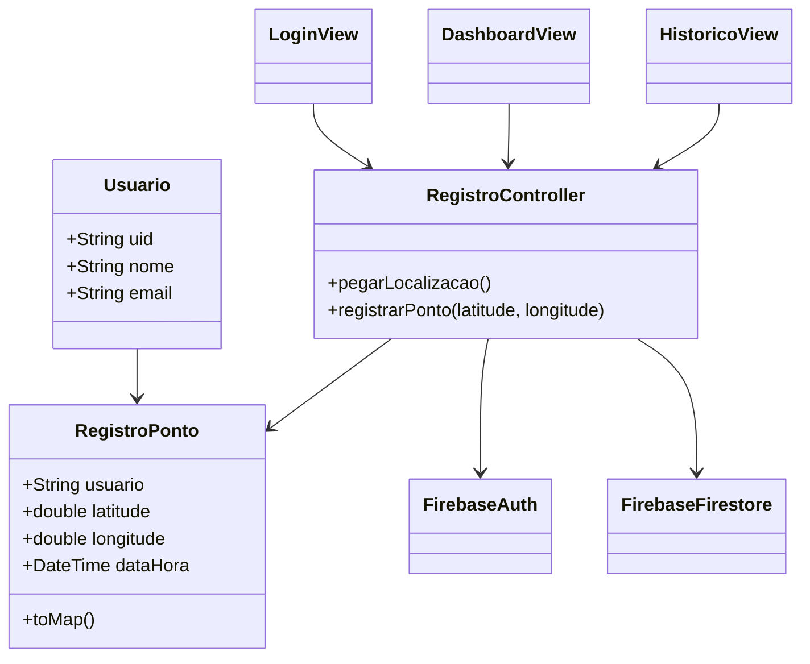
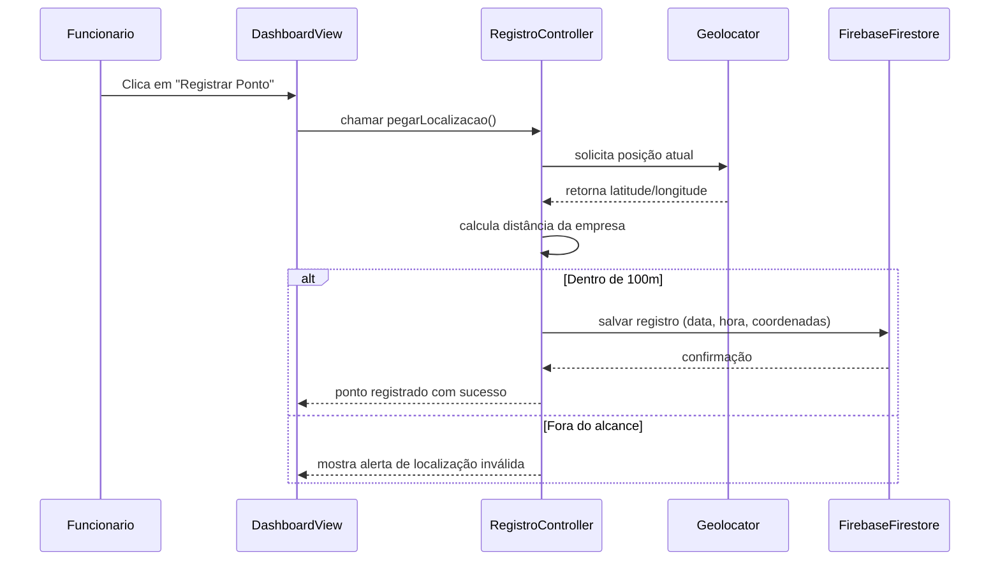

## Documentação do Projeto
App de Registro de Ponto com Geolocalização e Biometria
Este projeto foi desenvolvido para a Avaliação Somativa em Flutter, com o objetivo de colocar em prática os conhecimentos sobre desenvolvimento mobile, integração com o Firebase e uso de APIs externas (como geolocalização e biometria) em um cenário real de controle de ponto.

## Objetivos da Avaliação
Praticar o uso do framework Flutter.

Implementar autenticação de usuários.

Utilizar geolocalização e biometria para validação de presença.

Fazer o gerenciamento de dados em tempo real com o Firebase.

Aplicar boas práticas de UI/UX e manter o código organizado.

## Tema Escolhido: App de Registro de Ponto
Descrição
O app permite que o funcionário registre seu ponto de forma segura, apenas se estiver dentro de um raio de 100 metros do local de trabalho definido.

Funcionalidades Implementadas

Autenticação: Login com NIF/Email e Senha ou Reconhecimento Facial (Biometria).

Validação de Localização: Verifica automaticamente se o usuário está dentro do limite de 100 metros.

Registro de Ponto: Salva data, hora e coordenadas exatas do ponto batido.

Integração com Firebase: Usado tanto para autenticação quanto para armazenar os registros.

## Como Rodar o Aplicativo (Instalação e Uso)
Pré-requisitos
Antes de rodar o projeto, é preciso ter instalado:

Flutter SDK (versão compatível informada no pubspec.yaml).

IDE (Visual Studio Code ou Android Studio).

Um dispositivo físico ou emulador configurado.

## Configuração do Ambiente
Clone o Repositório:

Bash

git clone [LINK_DO_SEU_REPOSITORIO]
cd [NOME_DA_PASTA_DO_PROJETO]
Instale as Dependências:

Bash

flutter pub get
Configuração do Firebase:

Crie um projeto no Console do Firebase.

Habilite Authentication (Email/Password).

Habilite Firestore para o banco de dados.

Adicione o seu aplicativo Android e/ou iOS ao projeto Firebase.

Baixe o arquivo de configuração:

Android: Cole o arquivo google-services.json na pasta android/app/.

iOS: Siga as instruções para adicionar o GoogleService-Info.plist.

Configuração de Geolocalização:

Garanta que as permissões de localização estejam configuradas nos arquivos manifestos (Android: AndroidManifest.xml, iOS: Info.plist).

Execução:

Bash

flutter run

## Detalhes Técnicos e Design
Tecnologias Utilizadas

Flutter & Dart – Linguagem e framework principal.

Firebase Auth – Autenticação de usuários.

Cloud Firestore – Armazenamento de dados dos registros.

geolocator – Para capturar localização e calcular a distância (100m).

local_auth – Para autenticação biométrica.

## Decisões de Design (UI/UX)
O foco foi criar uma interface simples e funcional, fácil de entender e usar.

Filosofia: Menos cliques e mais praticidade.

Visual: Tons de roxo usados nos botões e detalhes, deixando o app com um visual limpo e agradável.

Estrutura: Código dividido em Models, Views e Controllers (MVC), o que facilita a manutenção e leitura.

## Desafios Encontrados e Soluções
Permissões de Localização: Resolvido usando a função de solicitação do pacote geolocator e configurando corretamente os manifestos.

Biometria: Foi adicionado um método alternativo de login (NIF/Senha) caso o reconhecimento facial falhe.

Cálculo de Distância (100m): Feito com o método distanceBetween do geolocator, que usa a fórmula de Haversine para garantir precisão.

Diagramas do Sistema

1. Diagrama de Classes



2. Diagrama de Casos de Uso


```mermaid
usecaseDiagram
    actor Funcionario

    Funcionario --> (Login com NIF/Email e Senha)
    Funcionario --> (Login com Biometria)
    Funcionario --> (Registrar Ponto)
    Funcionario --> (Visualizar Histórico de Pontos)
    Registrar Ponto --> (Validar Localização)
    Registrar Ponto --> (Salvar Registro no Firebase)
```

3. Diagrama de Sequência

